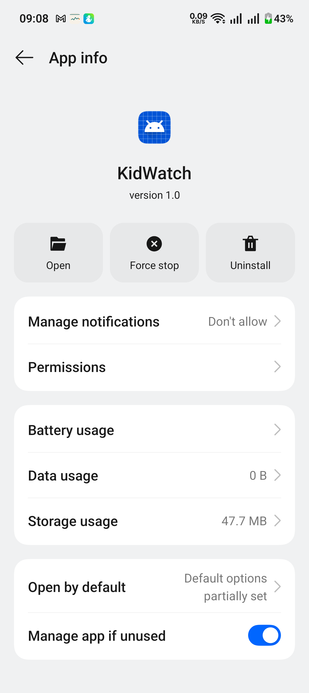
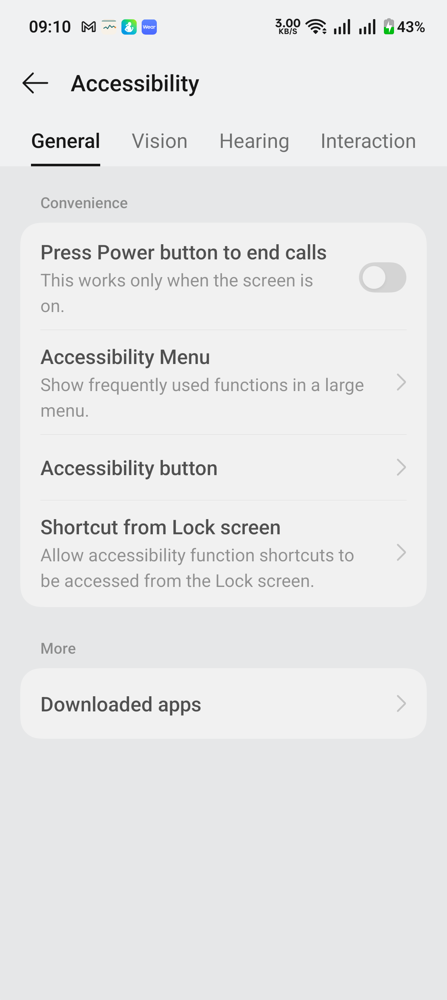
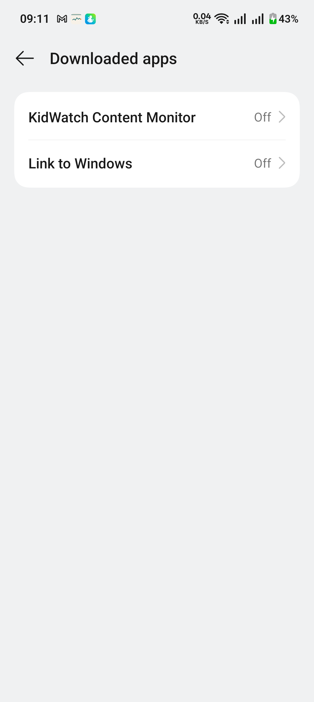
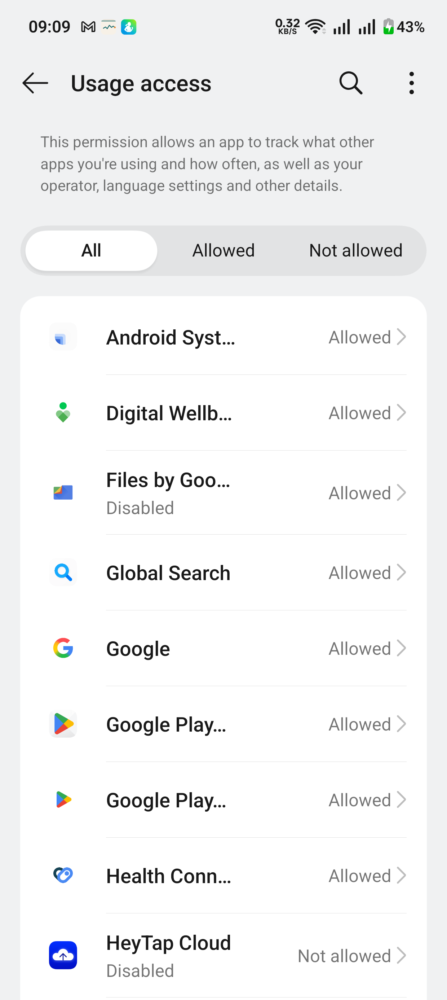

# KidWatch APK Install Guide

This guide is for direct APK testers installing `KidWatch` outside the Play Store.

## Official Reference Links

- Google Play Protect overview: [support.google.com/work/android/answer/15162069](https://support.google.com/work/android/answer/15162069?hl=en)
- Android restricted settings help: [support.google.com/android/answer/12623953](https://support.google.com/android/answer/12623953?hl=en)
- Android `Usage access` settings reference: [developer.android.com/reference/android/provider/Settings#ACTION_USAGE_ACCESS_SETTINGS](https://developer.android.com/reference/android/provider/Settings#ACTION_USAGE_ACCESS_SETTINGS)
- Android `Accessibility` settings reference: [developer.android.com/reference/android/provider/Settings#ACTION_ACCESSIBILITY_SETTINGS](https://developer.android.com/reference/android/provider/Settings#ACTION_ACCESSIBILITY_SETTINGS)

## Install Steps

1. Download the latest `KidWatch` APK to the phone.
2. Open the APK and continue the installer flow.
3. If Google Play Protect warns about the app:
   - Review the warning.
   - On devices that allow it, tap `More details` and then `Install anyway`.
   - If your device does not offer that option, ask the team for an updated build link or support.
4. Launch `KidWatch` after install.

## If Accessibility Is Blocked On Android 13+

Some direct APK installs are treated as restricted until you explicitly trust the app in Settings.

1. Open `Settings -> Apps -> KidWatch -> App info`.
2. Open the top-right overflow menu.
3. Tap `Allow restricted settings`.
4. Return to `KidWatch` and tap the accessibility setup button again.

Note:
- The `Allow restricted settings` menu may appear only for direct file installs and may not appear for ADB-installed builds.
- If you do not see the menu, confirm the app was installed from the shared APK file and not from ADB.

## Turn On Accessibility

1. Open `Settings -> Accessibility`.
2. Tap `Downloaded apps`.
3. Tap `KidWatch Content Monitor`.
4. Turn it on and confirm any warning dialog.

## Turn On Usage Access

1. Open `Settings -> Usage access`.
2. Find `KidWatch` in the list.
3. Tap it and allow usage access.

## Quick Tester Checklist

- APK installs successfully
- App launches to onboarding
- `KidWatch Content Monitor` is enabled in Accessibility
- `KidWatch` is allowed in Usage access
- Dashboard loads without setup warnings
